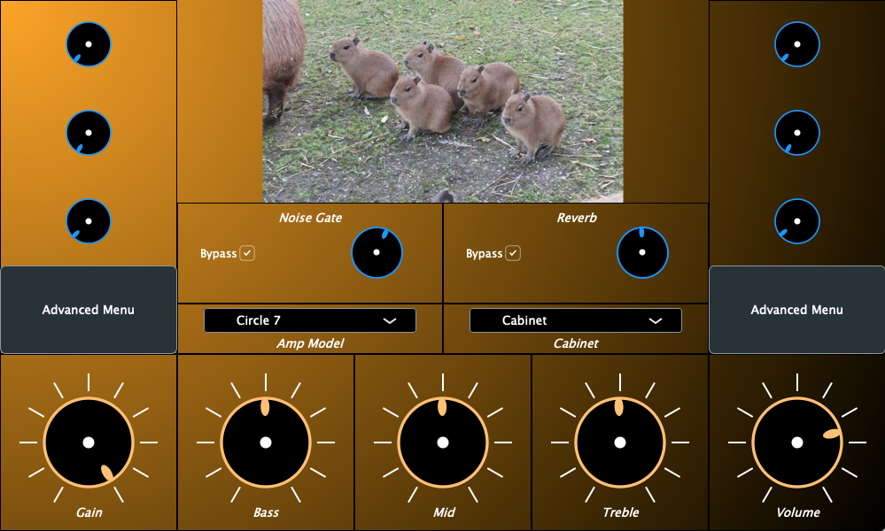

# GAE AmpSim
Gregory Lanier  
GT ECE 4808 GAE  
Spring 2022
  

## Overview
&nbsp;&nbsp;&nbsp;&nbsp;This is a plugin made for Dr. Lanterman's 4803 GAE (Guitar Amplificaiton and Effects) class. The plugin is meant to be a simulator for a guitar amplifier with a couple of effects.

## Installation
### Option 1: Installers
#### ***Windows***
&nbsp;&nbsp;&nbsp;&nbsp;Run the Windows installer GAEAmpSim-windows.exe inside the directory "Windows Installer/output/" in this repository.
#### ***Mac***
&nbsp;&nbsp;&nbsp;&nbsp;Run the Mac installer GAEAmpSim.pkg inside the directory "Mac Installer/" in this repository.
### Option 2: Building with Projucer
&nbsp;&nbsp;&nbsp;The JUCE framework is required to build this project from source. JUCE can be downloaded [here](https://juce.com/get-juce) or from the [JUCE github page](https://github.com/juce-framework/JUCE).
&nbsp;&nbsp;&nbsp;&nbsp;Along with this framework, the user must have a proper IDE that Juce can export to. This includes but is not limited to Xcode (MacOS) or Visual Studio (Windows).   
&nbsp;&nbsp;&nbsp;&nbsp;JUCE comes with the applicaiton Projucer. Open it and click File > Open to select this project's Projucer project file inside the "AmpSim" directory. After the project is loaded, select an exporter from the top (two are premade here) to open your IDE.  
Select the VST3 build configuration and build the project. After building is complete, there will be a .vst3 file generated inside the "Builds/*" directory. The exact location will depend on the IDE you use. I also noticed that Xcode actually puts the link to the generated VST here, but the VST is actually inside "Users/<user>/Library/Audio/Plug-Ins/VST3/".  
&nbsp;&nbsp;&nbsp;&nbsp;Copy this VST3 and paste it into an appropriate path used by your IDE.
Also copy the "Assets/AmpSim" folder (not "Assets", must copy "AmpSim" and all contained folders/files) found in this repository and paste it into a location dependant on your platform. For MacOS, paste it into "Applicaitons" (not "<user>/Applications). For Windows, paste it into "C:\Program Files".

## How the Plugin Works - JUCE Classes
  
### ProcessorEditor
&nbsp;&nbsp;&nbsp;&nbsp;The ProcessorEditor class arranges all of the visual elements of the plugin. This includes the window size along with the size and locaiton of all the interactive components like sliders, toggles, and combo boxes. The constructor is used to generate the components and attach the changing values to parameters in the APVTS. Currently, the only other member function used is resized(), where the size and position of components are assigned, but other functions such as paint() can be used for making more complex UI elements. In its current state, the plugin uses a method of placement that parses component bounds piece-by-piece instead of independantly placing and sizing each component. After attempts to fix the current visual state, I found that this method, though quick, is not very good for complex systems where a ton of labels are needed. This might also be due to the method of attaching labels directly to the slider though, also limiting the position of the label further. The way this class is implemented will definitely need refactoring in the future.
### AudioProcessorValueTreeState (APVTS)
&nbsp;&nbsp;&nbsp;&nbsp;The APVTS is a class used by the editor to communicate changes in the UI to values used by the AudioProcessor for DSP. Unique variables called attachments are used to load values into an APVTS's parameters, registered and indicated by an all caps name such as "GAIN". Before a buffer is processed, the APVTS is referenced in order to update DSP chain values.
### AudioProcessor
&nbsp;&nbsp;&nbsp;&nbsp;The AudioProcessor is the class used for what its name implies, audio processing. The main member functions used are prepareToPlay(), called when a plugin is first loaded, and processBlock(), called for every buffer being processed. From these functions, custom functions for updating and assigning DSP values can be found. This plugin is designed as a chain of ProcessorChains, which with the JUCE dsp_module, allow for bulk processing of a buffer with a variety of DSP classes without having to manually loop over every sample. This could have been done on one big chain, but during development, I contempleted adding intermediate steps in between the individual chains that I couldn't do with one large processor chain. The feature I implemented ended up being scrapped, but I left in the chain-of-chains method in case future development involved non-dsp_module processing.

## Digital Signal Processing - A Chain of Chains
  
### Input Chain
&nbsp;&nbsp;&nbsp;&nbsp;This is the first chain that the incoming audio buffer will be processed through. It starts with a noise gate to eliminate humming (optional) and includes a gain level that is used for controling input to the Tone and Amp chains.
#### ***Noise Gate***
&nbsp;&nbsp;&nbsp;&nbsp;This is made with a dsp::NoiseGate class. It includes a threshold, attack, and release. The class also includes an option for ratio, but I found that a static, really high ratio (in this case 100) was best. It works very well, though I admittedly don't have a good ear for compression, so the attack and release ranges could very well need adjusting  
&nbsp;&nbsp;&nbsp;&nbsp;&nbsp;&nbsp;&nbsp;&nbsp;Threshold: -60 to -40 dB  
&nbsp;&nbsp;&nbsp;&nbsp;&nbsp;&nbsp;&nbsp;&nbsp;Attack: 0 to 50 ms  
&nbsp;&nbsp;&nbsp;&nbsp;&nbsp;&nbsp;&nbsp;&nbsp;Release: 0 to 50 ms  
&nbsp;&nbsp;&nbsp;&nbsp;&nbsp;&nbsp;&nbsp;&nbsp;Ratio: 100  
#### ***Pregain***
&nbsp;&nbsp;&nbsp;&nbsp;This is made with the dsp:Gain class. It is a simple decibel level slider that cranks the input gain before reaching the waveshaping and coloring stages. Currently, all fully operational amplifiers use the same gain setting, but the non-operational Circle7 amp shows how the gain can be changed for certain other settings given you change the function arguments for updatePreGain.  
&nbsp;&nbsp;&nbsp;&nbsp;&nbsp;&nbsp;&nbsp;&nbsp;Gain: 50 to 80 dB  
  
### Tone Stack Chain
&nbsp;&nbsp;&nbsp;&nbsp;The tone stack aims to color the input signal before the waveshaping stage. It consists of a parametric, 3-knob slider for bass, mid, and treble controls.
#### ***Bass***
&nbsp;&nbsp;&nbsp;&nbsp;The bass slider controls a low-pass filter's cutoff frequency in the lower range of the guitar. It is set to go down to 60 Hz in preperation for use with a bass guitar.  
&nbsp;&nbsp;&nbsp;&nbsp;&nbsp;&nbsp;&nbsp;&nbsp;Frequency: 60 to 318 Hz  
&nbsp;&nbsp;&nbsp;&nbsp;&nbsp;&nbsp;&nbsp;&nbsp;Q: 0.2  
#### ***Mid***
&nbsp;&nbsp;&nbsp;&nbsp;The mid slider controls a peak filter's gain. It is at a set frequency to emulate the mid-scoop sound of a hardware tone stack.  
&nbsp;&nbsp;&nbsp;&nbsp;&nbsp;&nbsp;&nbsp;&nbsp;Frequency: 600 Hz   
&nbsp;&nbsp;&nbsp;&nbsp;&nbsp;&nbsp;&nbsp;&nbsp;Peak: -24 to 0 dB    
&nbsp;&nbsp;&nbsp;&nbsp;&nbsp;&nbsp;&nbsp;&nbsp;Q: 0.1  
#### ***Treble***
&nbsp;&nbsp;&nbsp;&nbsp;The treble slider controls a high-pass filter's cutoff frequency in the higher range of the guitar. I saw that this was also commonly implemented as a high-shelf, and I still think this implementation of a slider needs some tweaking, but I'm glad to have gotten something that colors the top end for now.  
&nbsp;&nbsp;&nbsp;&nbsp;&nbsp;&nbsp;&nbsp;&nbsp;Frequency: 800 to 2500 Hz  
&nbsp;&nbsp;&nbsp;&nbsp;&nbsp;&nbsp;&nbsp;&nbsp;Q: 0.2  

### Amp Chain
&nbsp;&nbsp;&nbsp;&nbsp;The amp chain aims to preform any waveshaping that is typical of a hardware amplifier. Currently, there is only a function-based waveshaper, but other components like a dc offset can be inserted into the chain for more depth and control.  
#### ***Waveshaper***
&nbsp;&nbsp;&nbsp;&nbsp;This stage is defined by a lambda function that loops through the samples for waveshaping purposes. Each amp name has a different algorithm used. These are categorized into low-gain and high-gain based on the clipping type, though, currently, the low-gain amps can still get pretty crunchy in the top 1/4 of the gain dial. There is also a clean option set as the default amp.  
&nbsp;&nbsp;&nbsp;&nbsp;&nbsp;&nbsp;&nbsp;&nbsp;Squeaky Clean: f(x) = x  
&nbsp;&nbsp;&nbsp;&nbsp;&nbsp;&nbsp;&nbsp;&nbsp;&nbsp;&nbsp;&nbsp;&nbsp;&nbsp;&nbsp;&nbsp;&nbsp;This is the clean setting. No waveshaping.  
&nbsp;&nbsp;&nbsp;&nbsp;&nbsp;&nbsp;&nbsp;&nbsp;Asinine: f(x) = x / ( abs(x) + 1)  
&nbsp;&nbsp;&nbsp;&nbsp;&nbsp;&nbsp;&nbsp;&nbsp;&nbsp;&nbsp;&nbsp;&nbsp;&nbsp;&nbsp;&nbsp;&nbsp;Asymptotic function. This is my favotite soft clipper. Sounds crunchy and still bright.  
&nbsp;&nbsp;&nbsp;&nbsp;&nbsp;&nbsp;&nbsp;&nbsp;Reptile: f(x) = (2/pi)*atan(x*(pi/2))  
&nbsp;&nbsp;&nbsp;&nbsp;&nbsp;&nbsp;&nbsp;&nbsp;&nbsp;&nbsp;&nbsp;&nbsp;&nbsp;&nbsp;&nbsp;&nbsp;Scaled arctan function. A little darker than Asinine.  
&nbsp;&nbsp;&nbsp;&nbsp;&nbsp;&nbsp;&nbsp;&nbsp;Geeky: f(x) = x/ sqrt( 1 + x^2 )  
&nbsp;&nbsp;&nbsp;&nbsp;&nbsp;&nbsp;&nbsp;&nbsp;&nbsp;&nbsp;&nbsp;&nbsp;&nbsp;&nbsp;&nbsp;&nbsp;Algebraic function. Very similar to Reptile.  
&nbsp;&nbsp;&nbsp;&nbsp;&nbsp;&nbsp;&nbsp;&nbsp;Smol Cronch: f(x) = tanh(x)  
&nbsp;&nbsp;&nbsp;&nbsp;&nbsp;&nbsp;&nbsp;&nbsp;&nbsp;&nbsp;&nbsp;&nbsp;&nbsp;&nbsp;&nbsp;&nbsp;The classic hyperbolic tangent waveshaping function.  
&nbsp;&nbsp;&nbsp;&nbsp;&nbsp;&nbsp;&nbsp;&nbsp;Fat Man: if -1 < x < 1, f(x) = (3/2)*x - (1/2)*x^3; -1 or 1 otherwise  
&nbsp;&nbsp;&nbsp;&nbsp;&nbsp;&nbsp;&nbsp;&nbsp;&nbsp;&nbsp;&nbsp;&nbsp;&nbsp;&nbsp;&nbsp;&nbsp;Polynomial hard clipper. Very deep sounding.  
&nbsp;&nbsp;&nbsp;&nbsp;&nbsp;&nbsp;&nbsp;&nbsp;Circle 7: Very complex mathematical condition from the Line 6 patent  
&nbsp;&nbsp;&nbsp;&nbsp;&nbsp;&nbsp;&nbsp;&nbsp;&nbsp;&nbsp;&nbsp;&nbsp;&nbsp;&nbsp;&nbsp;&nbsp;THIS AMP DOES NOT WORK!!! I couldn't figure out why after a while of debugging. I would really like to get this at some point.
&nbsp;&nbsp;&nbsp;&nbsp;&nbsp;&nbsp;&nbsp;&nbsp;Fork in Toaster: if -1 < x < 1, f(x) = x; -1 or 1 otherwise  
&nbsp;&nbsp;&nbsp;&nbsp;&nbsp;&nbsp;&nbsp;&nbsp;&nbsp;&nbsp;&nbsp;&nbsp;&nbsp;&nbsp;&nbsp;&nbsp;Classic hard clipper set to a max of 1.  

### Effects Chain
&nbsp;&nbsp;&nbsp;&nbsp;This chain is processed after the Amp Chain and is meant to mimic an effects loop on a hardware amp.  
#### ***Reverb***
&nbsp;&nbsp;&nbsp;&nbsp;This is a classic reverb with 4 controls. The mix is more of a full transition away from the dry output, which could probably be improved.  
&nbsp;&nbsp;&nbsp;&nbsp;&nbsp;&nbsp;&nbsp;&nbsp;Mix: 0 to 1 wet/dry level  
&nbsp;&nbsp;&nbsp;&nbsp;&nbsp;&nbsp;&nbsp;&nbsp;Room Size: 0 to 1  
&nbsp;&nbsp;&nbsp;&nbsp;&nbsp;&nbsp;&nbsp;&nbsp;Damping: 0 to 1  
&nbsp;&nbsp;&nbsp;&nbsp;&nbsp;&nbsp;&nbsp;&nbsp;Width: 0 to 1  
  
### Output Chain
&nbsp;&nbsp;&nbsp;&nbsp;This is the final chain before the audio buffer is passed to the next plugin in a DAW's channel.  
#### ***Master Volume***
&nbsp;&nbsp;&nbsp;&nbsp;Decibel gain level setting to compensate from the increased pregain. Meant to avoid clipping in a DAW.  
&nbsp;&nbsp;&nbsp;&nbsp;&nbsp;&nbsp;&nbsp;&nbsp;Gain: -40 to -20 dB  
#### ***Cabinet (Convolution)***
&nbsp;&nbsp;&nbsp;&nbsp;This stage uses convolution to mimic the effect a cabinet and microphone would have on a guitar's tone. It generally adds more of a full body to the sound. Currently, there are only two settings: one for a guitar cabinet, and one to sound like it is being run through a tape recorder.  
&nbsp;&nbsp;&nbsp;&nbsp;&nbsp;&nbsp;&nbsp;&nbsp;Guitar Amp  
  &nbsp;&nbsp;&nbsp;&nbsp;&nbsp;&nbsp;&nbsp;&nbsp;&nbsp;&nbsp;&nbsp;&nbsp;&nbsp;&nbsp;&nbsp;&nbsp;Sounds very full and powerful.  
&nbsp;&nbsp;&nbsp;&nbsp;&nbsp;&nbsp;&nbsp;&nbsp;Cassette Recorder  
  &nbsp;&nbsp;&nbsp;&nbsp;&nbsp;&nbsp;&nbsp;&nbsp;&nbsp;&nbsp;&nbsp;&nbsp;&nbsp;&nbsp;&nbsp;&nbsp;Very tingey and old-school.  

## Current Progress
&nbsp;&nbsp;&nbsp;&nbsp;Everything visible in the plugin is fully tested and operational outside of the Circle 7 amp. The chain-of-chains method could be scrapped if no other types of processing in between steps are intended, or the chain system could be scrapped for individual process() calls. Overall, I'm very happy with what I got done with the time I was given :).
  
## Intended Additions
&nbsp;&nbsp;&nbsp;&nbsp;The sections above highlight specific details that need to be improved, such as the operation of the Circle 7 amp and tweaking some knobs like the treble and reverb mix. I intended to put a delay module in the effects chain, but I didn't have time to completely rework the UI as I mentioned above, which would have been required given the insanity that the slider-attached labels create. That would be the first step I'd take for additions. I also left room for at least one more module, such as a phasor. It's also possible to replace the generic UI with other component views, which I would follow up with. From there, I would come back and tweak everything else from a meticulous view.  

## References
[The Audio Programmer](https://www.youtube.com/c/TheAudioProgrammer)  
[MatKatMusic](https://www.youtube.com/matkatmusic)  
Blue Mangoo Software: [Comparing Waveshaping Functions for Guitar Modeling](https://www.youtube.com/watch?v=2fb47zQdLy0&t=938s)  
Martin Vicanek: [Waveshaper Harmonics](https://www.vicanek.de/articles/WaveshaperHarmonix.pdf)  
Amp Books: [Digital Modeling of Guitar Amplifier Preamp Distortion](https://www.ampbooks.com/mobile/dsp/preamp/)  
